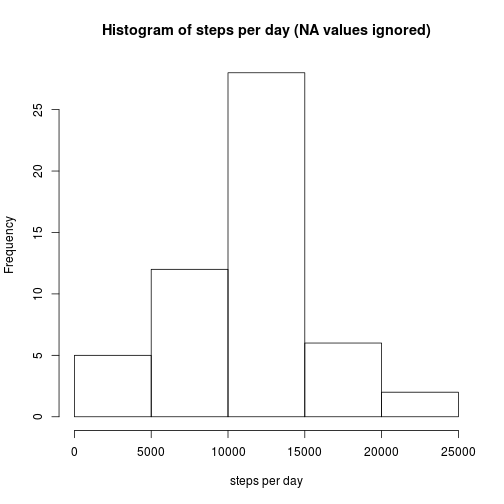
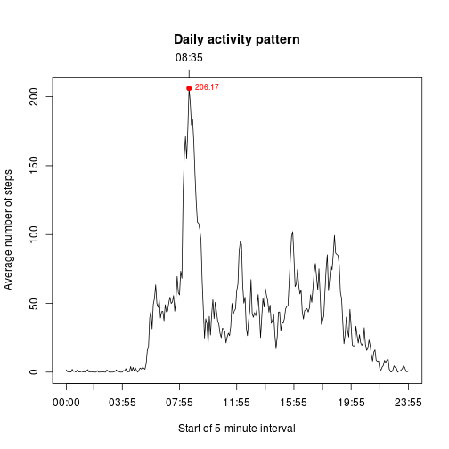
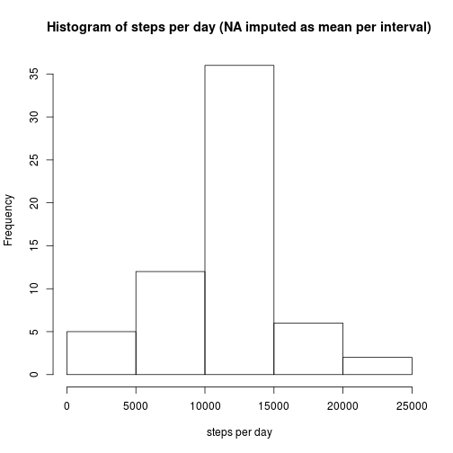
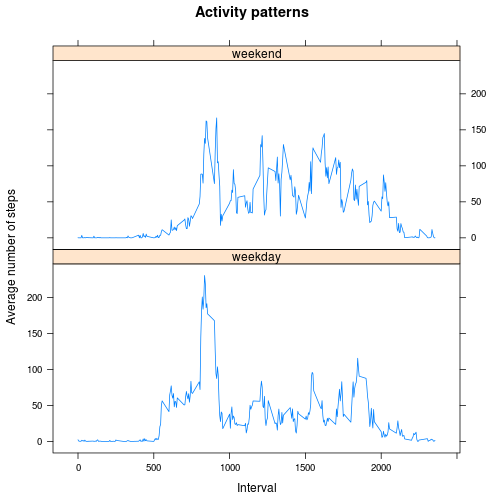

## Loading and preprocessing the data

Below the data is loaded and the dates, originally read as strings, are converted to `Date`. The `str()` function shows the structure of the resulting data frame.


```r
activity <- read.csv("activity.csv", stringsAsFactors = FALSE)
activity$date <- as.Date(activity$date)
str(activity)
```

```
## 'data.frame':	17568 obs. of  3 variables:
##  $ steps   : int  NA NA NA NA NA NA NA NA NA NA ...
##  $ date    : Date, format: "2012-10-01" "2012-10-01" ...
##  $ interval: int  0 5 10 15 20 25 30 35 40 45 ...
```


## What is mean total number of steps taken per day?

Below is calculated the total number of steps per day and a histogram with the set of totals is plotted. The `sum` function is used with the `na.rm` parameter as FALSE because the `NA` values are being *ignored*, not imputed as zero. If the `na.rm` parameter was setted as TRUE all unavailable data would appear in the 0-5000 range.


```r
stepsPerDay <- tapply(activity$steps, activity$date, sum)
hist(stepsPerDay,
     main = "Histogram of steps per day (NA values ignored)",
     xlab = "steps per day")
```

 

Reporting the median and mean of steps per day.


```r
median(stepsPerDay, na.rm = TRUE)
```

```
## [1] 10765
```

```r
mean(stepsPerDay, na.rm = TRUE)
```

```
## [1] 10766.19
```

## What is the average daily activity pattern?

Below is made a plot with the average number of steps per 5-minute interval across all days (1). The interval with the maximum number of steps on average is highlighted in red (2).


```r
library(dplyr)
avgStepsPerInt <-
    activity %>%
    group_by(interval) %>%
    summarise(avg_steps = mean(steps, na.rm = TRUE)) %>%
    mutate(interval_mt = sub("(..)(..)", "\\1:\\2", sprintf("%04d", interval))) # Transforming the interval names in "military time". Eg. 100 -> 01:00

par(mar = c(5.1, 4.1, 6, 2.1))

# Don't plotting the x-axis. It will be inserted later.
plot(1:length(avgStepsPerInt$interval_mt),
     avgStepsPerInt$avg_steps,
     type = "l",
     xaxt = "n",
     xlab = "Start of 5-minute interval",
     ylab = "Average number of steps",
     main = "Daily activity pattern")

# Plots the x-axis at the bottom of the graph. Adds the ticks every 24 5-minute intervals.
axis(1,
     at=c(1,seq(0,288,by=24)[-1]),
     labels = avgStepsPerInt$interval_mt[c(1,seq(0,288,by=24)[-1])],
     tick = TRUE)

# Plots the x-axis at the top of the graph. Adds only one tick in the 5-minute interval with the highest average number of steps.
axis(3,
     at=which.max(avgStepsPerInt$avg_steps),
     labels = avgStepsPerInt$interval_mt[which.max(avgStepsPerInt$avg_steps)])

# Highlights with a red dot the point with the highest average number of steps.
points(which.max(avgStepsPerInt$avg_steps),
       max(avgStepsPerInt$avg_steps),
       pch = 19,
       col = "red")

# Write the maximum value in red in the plot.
text(which.max(avgStepsPerInt$avg_steps),
     max(avgStepsPerInt$avg_steps),
     labels = round(max(avgStepsPerInt$avg_steps), 2),
     pos = 4,
     col = "red",
     cex = 0.7)
```

 


## Imputing missing values

There are some missing values in the `steps` column:


```r
summary(activity)
```

```
##      steps             date               interval     
##  Min.   :  0.00   Min.   :2012-10-01   Min.   :   0.0  
##  1st Qu.:  0.00   1st Qu.:2012-10-16   1st Qu.: 588.8  
##  Median :  0.00   Median :2012-10-31   Median :1177.5  
##  Mean   : 37.38   Mean   :2012-10-31   Mean   :1177.5  
##  3rd Qu.: 12.00   3rd Qu.:2012-11-15   3rd Qu.:1766.2  
##  Max.   :806.00   Max.   :2012-11-30   Max.   :2355.0  
##  NA's   :2304
```

They correspond to ~13% of the values in this column of the dataset (1).

Since the missing `steps` values are all the 288 5-minute intervals in eigth days, it is possible to recycle `avgStepsPerInt$avg_steps` to impute the missing values as the mean per interval (2) in a new data frame (3).


```r
# Verifying that the NA values are all the 5-minute intervals in 8 days
missingValues <- activity[is.na(activity$steps), ]
tapply(missingValues$steps, missingValues$date, length)
```

```
## 2012-10-01 2012-10-08 2012-11-01 2012-11-04 2012-11-09 2012-11-10 
##        288        288        288        288        288        288 
## 2012-11-14 2012-11-30 
##        288        288
```

```r
# Filling in the missing "steps" values with the mean per interval
activity2 <- activity
activity2[is.na(activity2$steps), ]$steps <- avgStepsPerInt$avg_steps
```

Making a histogram of the new dataset (4):


```r
stepsPerDay2 <- tapply(activity2$steps, activity2$date, sum)
hist(stepsPerDay2,
     main = "Histogram of steps per day (NA imputed as mean per interval)",
     xlab = "steps per day")
```

 

With the devised strategy to fill the missing values, the updated dataset has the same mean and median. Opposed to the original that have a slightly different mean and median (4).


```r
median(stepsPerDay, na.rm = TRUE)
```

```
## [1] 10765
```

```r
median(stepsPerDay2)
```

```
## [1] 10766.19
```

```r
mean(stepsPerDay, na.rm = TRUE)
```

```
## [1] 10766.19
```

```r
mean(stepsPerDay2)
```

```
## [1] 10766.19
```

## Are there differences in activity patterns between weekdays and weekends?

A factor column will be created in the data frame to indicate if a date is a weekday or weekend (1):


```r
# Certifying that the locale is English
Sys.setlocale("LC_TIME", "en_US.utf8")
```

```
## [1] "en_US.utf8"
```

```r
w <- weekdays(activity2$date, abbreviate = TRUE) %in% c("Sat", "Sun")
activity2$weekday <- factor(w, labels = c("weekday", "weekend"))
```

A panel plot shows the difference between the subject activity in weekdays and weekends (2):


```r
library(lattice)

avgStepsPerInt2 <-
    activity2 %>%
    group_by(interval, weekday) %>%
    summarise(avg_steps = mean(steps)) %>%
    mutate(interval_mt = sub("(..)(..)", "\\1:\\2", sprintf("%04d", interval)))

xyplot(avg_steps ~ interval | weekday, data = avgStepsPerInt2,
       type="l",
       layout = c(1,2),
       main = "Activity patterns",
       xlab = "Interval",
       ylab = "Average number of steps")
```

 

